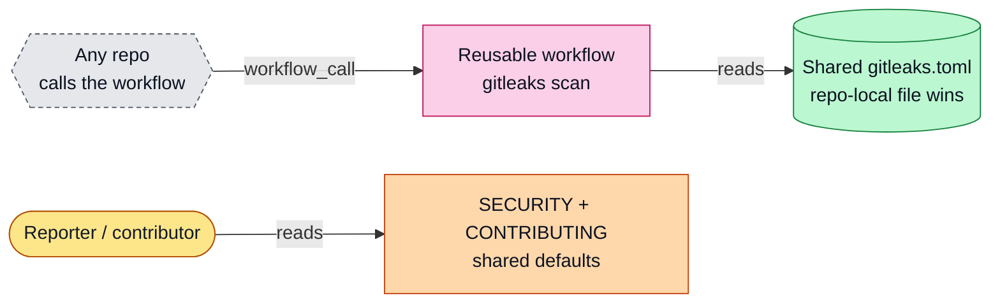

# .github

Shared security and contributing notes for the repositories owned by [thefiredev-cloud](https://github.com/thefiredev-cloud), the GitHub account of Tanner Osterkamp, founder of [Kodros](https://kodros.ai). The repositories hold small tools for AI agents, Kodros code, and forks of other projects. This is a personal account, not an organization.

GitHub uses a file from this repository when a repository does not have its own copy. These notes are shared:

- [SECURITY.md](SECURITY.md): how to report a vulnerability privately
- [CONTRIBUTING.md](CONTRIBUTING.md): how to propose changes

This repository also holds the [portfolio table](profile/README.md): every product, what it is, its status with a date, its link and its repository. Product READMEs and websites must agree with it. GitHub does not show a `profile/` folder on a personal account, so the table is read here.

The profile page itself lives in [thefiredev-cloud/thefiredev-cloud](https://github.com/thefiredev-cloud/thefiredev-cloud).

<!-- arch:begin -->
## Architecture

Shared defaults: security and contributing policy, plus a reusable gitleaks secret-scan workflow.


```mermaid
flowchart LR
  caller{{"Any repo<br/>calls the workflow"}}:::ext
  wf["Reusable workflow<br/>gitleaks scan"]:::job
  cfg[("Shared gitleaks.toml<br/>repo-local file wins")]:::store
  policy["SECURITY + CONTRIBUTING<br/>shared defaults"]:::doc
  reporter(["Reporter / contributor"]):::actor
  caller -->|"workflow_call"| wf
  wf -->|"reads"| cfg
  reporter -->|"reads"| policy
  classDef actor fill:#fde68a,stroke:#b45309,color:#111827
  classDef doc fill:#fed7aa,stroke:#c2410c,color:#0b1220
  classDef ext fill:#e5e7eb,stroke:#4b5563,color:#0b1220,stroke-dasharray:4 3
  classDef job fill:#fbcfe8,stroke:#be185d,color:#0b1220
  classDef store fill:#bbf7d0,stroke:#15803d,color:#0b1220
```

[Full architecture](docs/ARCHITECTURE.md) · Hi-res: [SVG](docs/architecture/whiteboard.svg) · [PNG 3x](docs/architecture/whiteboard@3x.png) · [dark PNG](docs/architecture/whiteboard.dark@3x.png) · [Explorable (Archify)](docs/architecture/dot-github.archify.html) · [Graphify report](docs/architecture/graphify/GRAPH_REPORT.md)
<!-- arch:end -->

## Secret scan

Call the reusable workflow from a repo's workflow file:

```yaml
jobs:
  gitleaks:
    uses: thefiredev-cloud/.github/.github/workflows/gitleaks-reusable.yml@main
```

- Optional input `gitleaks-version`: plain `x.y.z`, default `8.21.2`.
- A repo-local `.gitleaks.toml` replaces the shared `gitleaks/gitleaks.toml`.
- Shared config (`gitleaks/gitleaks.toml`) keeps the gitleaks default rules (`[extend] useDefault = true`) and adds two Stripe rules: live keys anywhere, and live-key prefixes in test or fixture paths. It allowlists one dummy test key, named in that file.
- Pull requests scan the base..head range. Other events scan full history.
- Local hook: install `pre-commit`, copy `gitleaks/pre-commit-config.example.yaml` to `.pre-commit-config.yaml`, then run `pre-commit install`. It needs `gitleaks` on PATH.
  The hook does not read the shared config. Without a repo-local `.gitleaks.toml`, it flags the allowlisted dummy key that CI accepts. To match CI, copy `gitleaks/gitleaks.toml` to `.gitleaks.toml`.

## License

All rights reserved. See [LICENSE](LICENSE). Licensing questions and contact: [tanner@kodros.ai](mailto:tanner@kodros.ai).
